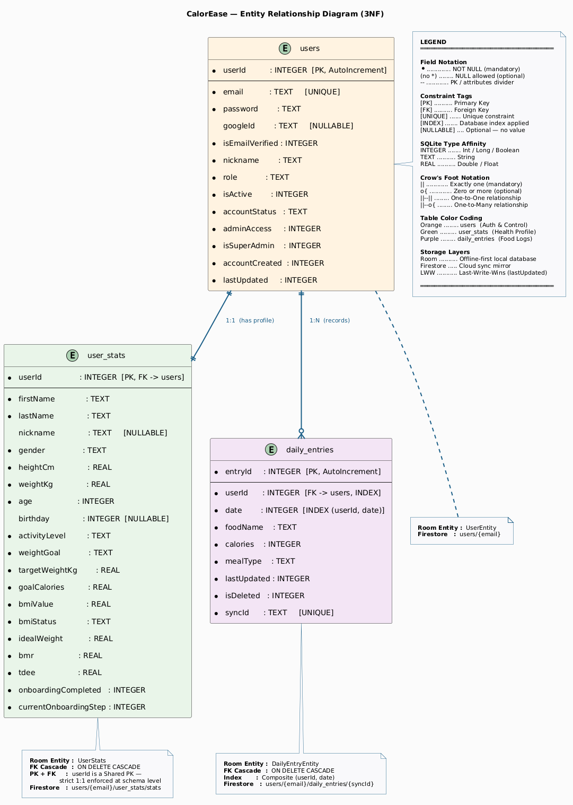

# 🥗 CalorEase - your smart calorie companion

> **Individual Project By:** Oliver Jann Klein Borre  
> **Institution:** Mapua Malayan Digital College  
> **Course:** MO-IT119 Mobile Development Application  

---


## 📱 App Description

**CalorEase** is a comprehensive offline-first calorie tracking companion designed to help users establish consistent daily habits and achieve their weight goals. The app calculates personalized daily calorie targets based on user metrics (BMR/TDEE) and provides an intuitive, real-time interface for logging food intake, tracking progress through visual indicators, and monitoring weight changes over time.

The application features dual-mode functionality with separate dashboards for regular users and administrators, complete offline support utilizing a Last-Write-Wins Room database, and seamless secure NoSQL data synchronization with Firebase Firestore via background workers.

---

## 🔑 Test User Credentials

### Regular User Account
| Role | Email | Password | Status |
| :--- | :--- | :--- | :--- |
| **USER** | `palenciafrancisadrian@gmail.com` | `TestUser123!` | **Active** |

### Administrator Account
| Role | Email | Password | Status |
| :--- | :--- | :--- | :--- |
| **ADMIN** | `blitzalexandra19@gmail.com` | `AdminUser123!` | **Active** |

**Admin Features:**
- Full access to user dashboard (personal tracking)
- Admin dashboard with statistics (total users, active/deactivated accounts)
- User management (view all users, deactivate/reactivate accounts)
- Dashboard mode toggle (switch between admin and user views)

---

## 🚀 Features Implemented

### Sprint 1: User Input Handling & Visual Architecture
1. **Email Format & Password Strength Validation** - Real-time email and password indicators assessing security strengths via regex logic.
2. **Numeric Input Bounds** - Range protections mapping physical metrics (Age, Height, Weight) against impossible parameters.
3. **Calorie Matrix Protections** - Protected float parameters scaling up to 10,000kcal single-entry ceilings.
4. **Interactive Security Dialogs** - Dual-stage confirmations protecting account deletions, logouts, and severe calorie target updates dynamically.
5. **Form Submission Mutexes** - Disabled UI mechanisms ensuring overlapping network or database submissions cannot collide natively.

### Sprint 2: Navigation Matrices
1. **Type-Safe Navigation Graphs** - Fully structured compile-time safe routing matrices mapping 17 unique Composable destinations.
2. **Offline Splash / Session States** - Memory injection checking local DataStore values to bypass Login screens if persistent sessions are active.
3. **Admin Dashboard Topologies** - Independent UI trees built natively for elevated Admin roles scaling user matrices.
4. **Transient Stack Cleanses** - `popUpTo(inclusive)` parameters systematically purging Auth stacks so users cannot back-swipe into logged-out topologies.

### Sprint 3: Offline Data Management (Room SQLite)
1. **Safe Database Migrations (`MIGRATION`)** - Destructive migrations disabled. Implemented native non-destructive schema altercations allowing seamless offline software upgrades without data wipes.
2. **Flow-Based Live Recomposition** - Room DAO mappings wrapped purely in Kotlin `Flow` parameters causing the UI (circular trackers, historical columns) to repaint automatically upon any background local DB modifications.
3. **Database Race-Condition Eliminations** - Protected internal seeding protocols natively inside the SQLite onCreate callbacks, mapping the Test and Admin accounts safely.
4. **Offline Auth Resilience** - Local validation layers saving Onboarding checkpoints (Nickname -> Stats -> Goal) across sessions ensuring App closes mid-tutorial do not dump data.
5. **Soft Account Deactivations** - Admin panels mapped to boolean database toggles (`isActive`) preventing users from logging in, without destroying their historical food data for Admin analytics.

### Sprint 4: Cloud Synchronizations & API Validations
1. **Firestore NoSQL Integration & DTO Maps** - Integrated comprehensive Firebase sub-collection architecture accurately mimicking the complex SQLite ERD mappings in scalable Cloud topologies.
2. **Two-Way Background Reconciliation** - Scheduled `WorkManager` protocols analyzing `lastUpdated` timestamp vectors across local and remote ecosystems executing a sophisticated "Last-Write-Wins" queueing network.
3. **Offline Network Restraints** - Injected rigorous native `NetworkUtils` checks seamlessly into Auth topologies, preemptively deploying standard `StatusDialog` blockades preventing App crashes against offline Firebase calls.
4. **Abstract Email Deliverability Verification** - Integrated `Retrofit2` mapping the remote Abstract API with automated 800ms Kotlin Coroutine `delay()` debounce logic. Verifies if email domains actually exist and rejects disposable accounts natively before firing Firebase registers.
5. **One-Tap Google OAuth** - Implemented the modern Android `CredentialManager` API bypassing redundant legacy Google Clients mapping seamless Single Sign-On (SSO) routines natively into Auth flows.
6. **Reactive Sync Visuals** - Deployed dynamic UI indicator clouds to the Core Dashboards analyzing local Network boundaries scaling native status warnings to users implicitly.
7. **Resilient Reinstall Sync Deployments** - `SyncManager` natively identifies missing offline `UserStats` during fresh application reinstalls, instantly triggering a blocking download override ignoring UNIX timestamps to safely rescue cloud data from zero-state local deletions.

---

## 🛠 Tech Stack

- **Language:** Kotlin 2.1.0+
- **UI Framework:** Jetpack Compose (Material3)
- **Architecture:** MVVM Design Patterns
- **Dependency Injection:** Dagger Hilt
- **Local Database:** Room Database (Flow architectures)
- **Remote Database:** Firebase Firestore (NoSQL Document stores)
- **Authentication:** Firebase Auth & Android CredentialManager (Google OAuth)
- **Networking APIs:** Retrofit2 & Gson (Abstract API Deliverability)
- **Background Processes:** Android WorkManager
- **Persistence:** Jetpack DataStore (Preferences)

---

## 💻 Development Environment

### Android Studio
- **Build:** #AI-252.28238.7.2523.14688667
- **Runtime Version:** 21.0.8+-14196175-b1038.72 amd64
- **Gradle Version:** 9.1.0
- **Kotlin Version:** 2.1.0
- **Compose Compiler:** 2.1.0

### Tested Devices
- **POCO F3:** 6.67" AMOLED, 1080x2400 (Android 11)
- **Huawei Nova 400:** 6.5" OLED, 1080x2340 (Android 12+)

---

## 🏗️ Project Structure

```text
app/src/main/java/com/sample/calorease/
├── data/
│   ├── local/              
│   │   ├── dao/                 # Room DAOs (Query definitions)
│   │   ├── entity/              # SQL Tables (User, Stats, Entries)
│   │   └── AppDatabase.kt       # Room configurations & Safe Migrations
│   ├── remote/             
│   │   ├── api/                 # Retrofit2 HTTP configurations & JSON Models
│   │   └── FirestoreService.kt  # NoSQL Document & Subcollection topologies
│   ├── repository/              # Centralized repository implementations
│   └── session/                 # DataStore mapping engines
├── domain/             
│   ├── model/                   # Pure native application paradigms
│   ├── repository/              # Repository interfaces isolating Logic
│   ├── sync/                    # WorkManager & Last-Write-Wins Schedulers
│   └── usecase/                 # Decoupled mathematical BMR/TDEE calculations
└── presentation/
    ├── components/              # Reusable responsive components & dialogs
    ├── navigation/              # Compose Navigation architectures
    ├── screens/                 # Core modular User Interfaces
    ├── theme/                   # Aesthetic mappings (Color, Type, Theme)
    └── viewmodel/               # ViewModels mapping Logic streams
```

---

## 📊 Key Functionalities

### User Features
- **Personalized Calorie Tracking** - BMR/TDEE-based daily targets
- **Food Intake Logging** - Add, edit, delete daily calorie entries with real-time UI recompilations.
- **Progress Visualization** - Flow-state color-coded dashboards actively reading SQL alterations.
- **Physical Stats Tracking** - Seamless Profile updates syncing across DataStore, Mobile, and Web simultaneously.
- **External Email Validations** - Account creation actively blocks unreachable or synthetic temporary email accounts dynamically.
- **Offline Tracking** - Enter and customize foods dynamically during airplane mode with passive WorkManager cloud syncs triggering automatically upon network recovery.

### Admin Features
- **User Statistics Dashboard** - Total users, active/deactivated counts
- **Soft Delete Management** - Non-destructive account blocks preserving legacy metric tracking securely.
- **Dual Dashboard Access** - Toggle between elevated management structures and personal health dashboards.

---

## 🔐 Security & Data Operations

- **Cloud/Local Mirroring** - All primary read operations load flawlessly out of Room SQLite offline, shielding application limits.
- **Asynchronized Networking** - Cloud modifications are queued invisibly utilizing intelligent timestamp vectors to prevent conflict merges gracefully.
- **Preemptive Error Restraints** - Application checks API endpoints and network states intrinsically before emitting network bounds avoiding crash loops.
- **Password Policies** - Deep character boundaries requiring digits and alphanumerics parsed natively across Regex expressions.

---

## 📈 Database Design

> [!NOTE]
> CalorEase uses **one unified 3NF-normalized schema** consisting of 3 tables. This same schema is persisted across two storage layers: **Room SQLite** (offline-first local source of truth) and **Firebase Firestore** (cloud sync mirror). Firestore is **not a separate schema** — it is a document-based projection of the identical normalized data model.

### 1. Entity Relationship Diagram (ERD)



### 2. Data Dictionary (Unified Schema)


#### Table 1 — `users`
| Column | Data Type | Key | Description |
| :--- | :--- | :--- | :--- |
| `userId` | Int | **PK** (AutoGen) | Globally unique user identifier, synced against Firestore max before every new insert to prevent collisions |
| `email` | String | Unique Index | Core authentication credential — also used as Firestore document ID |
| `password` | String | | Password (plain text in prototype; FK-separated from stats for auth isolation) |
| `googleId` | String? | | Nullable Google SSO token mapper |
| `nickname` | String | | Display name shown in dashboard |
| `role` | String | | Access level: `USER` or `ADMIN` |
| `isActive` | Boolean | | Soft deactivation flag (preserves history for admin analytics) |
| `accountStatus` | String | | Human-readable status: `active` or `deactivated` |
| `adminAccess` | Boolean | | Elevated admin dashboard permissions |
| `isSuperAdmin` | Boolean | | Immutable super-admin guard (cannot be overwritten by sync) |
| `isEmailVerified` | Boolean | | Abstract API email deliverability result |
| `accountCreated` | Long | | Epoch registration timestamp |
| `lastUpdated` | Long | | Last-Write-Wins conflict resolution timestamp |

#### Table 2 — `user_stats`
| Column | Data Type | Key | Description |
| :--- | :--- | :--- | :--- |
| `userId` | Int | **PK + FK** → `users` | 1-to-1 link to `users(userId)`. CASCADE DELETE enforced. |
| `firstName` | String | | User's given name |
| `lastName` | String | | User's family name |
| `gender` | String | | `MALE` or `FEMALE` |
| `birthday` | Long? | | Birth date as epoch timestamp (nullable) |
| `age` | Int | | Age calculated from birthday |
| `heightCm` | Double | | Height in centimetres |
| `weightKg` | Double | | Current weight in kilograms |
| `targetWeightKg` | Double | | Goal weight in kilograms |
| `activityLevel` | String | | Calorie multiplier: `SEDENTARY` → `VERY_ACTIVE` |
| `weightGoal` | String | | `LOSE_0_25_KG`, `LOSE_0_5_KG`, `MAINTAIN`, `GAIN_0_5_KG`, etc. |
| `goalCalories` | Double | | Daily calorie target (BMR × activity factor ± goal adjustment) |
| `bmiValue` | Double | | Body Mass Index (weight / height²) |
| `bmiStatus` | String | | `Underweight`, `Normal`, `Overweight`, or `Obese` |
| `idealWeight` | Double | | Calculated ideal weight at BMI 22.0 midpoint |
| `bmr` | Double | | Basal Metabolic Rate (Mifflin-St Jeor formula) |
| `tdee` | Double | | Total Daily Energy Expenditure |
| `onboardingCompleted` | Boolean | | Navigation gatekeeper — must be `true` to reach Dashboard |
| `currentOnboardingStep` | Int | | Onboarding resume point (1–4) for interrupted sessions |

#### Table 3 — `daily_entries`
| Column | Data Type | Key | Description |
| :--- | :--- | :--- | :--- |
| `entryId` | Int | **PK** (AutoGen) | Unique food log record identifier |
| `userId` | Int | **FK** → `users`, Index | Links to `users(userId)`. CASCADE DELETE enforced. |
| `date` | Long | Composite Index | Start-of-day epoch boundary (indexed with `userId` for fast dashboard queries) |
| `foodName` | String | | User-entered food description |
| `calories` | Int | | Total caloric value of the food item |
| `mealType` | String | | `Breakfast`, `Lunch`, `Dinner`, or `Snack` |
| `isDeleted` | Boolean | | Soft-delete flag — propagated to Firestore before physical removal |
| `syncId` | String | Unique (UUID) | Stable Firestore document identifier — prevents duplication across reinstalls |
| `lastUpdated` | Long | | Conflict resolution timestamp (Last-Write-Wins sync strategy) |

### 3. Cloud Persistence Mapping (Firestore)

The same 3 normalized entities above are mirrored to Firebase Firestore as a document-based projection. **This is not a second schema** — it is the same data model stored in NoSQL format for cloud access:

| Firestore Path | Maps To | Relationship |
| :--- | :--- | :--- |
| `users/{email}` | `users` table | One document per user. Email is the document key. |
| `users/{email}/user_stats/stats` | `user_stats` table | Fixed single sub-document — mirrors the 1-to-1 Room relationship. |
| `users/{email}/daily_entries/{syncId}` | `daily_entries` table | One document per food entry, keyed by `syncId` UUID. |

Sync direction is bidirectional via `SyncManager` using a **Last-Write-Wins** strategy (`lastUpdated` timestamp). Room is always written first (offline-safe); Firestore is updated best-effort with WorkManager retry on failure.

---

### 4. Normalization Explanation (3rd Normal Form Validation)

The **Room Relational Database** was specifically engineered to achieve the **3rd Normal Form (3NF)** to ensure minimal data redundancy and guarantee data integrity prior to syncing to the NoSQL cloud:

1. **First Normal Form (1NF):**
   - Every column contains atomic (indivisible) values (e.g., `firstName` and `lastName` are distinct strings, never merged).
   - Every table has an explicit, unique Primary Key (`userId` for `users`/`user_stats`, `entryId` for `daily_entries`).

2. **Second Normal Form (2NF):**
   - No partial dependencies are present. All non-key attributes depend completely on the entire Primary Key of their respective table. Every `daily_entries` attribute (`foodName`, `calories`) depends solely on its `entryId`.

3. **Third Normal Form (3NF):**
   - No transitive dependencies exist. The key architectural decision was **separating `users` from `user_stats`** despite their 1-to-1 relationship.
   - **Why?** The `users` table manages volatile *authentication boundaries* (`password`, `isActive`, `role`). The `user_stats` table manages dynamic, computation-heavy profile data (`bmiValue`, `bmr`, `goalCalories`). Separating them ensures a weight goal update never triggers a lock on authentication columns — satisfying strict 3NF integrity and enabling independent sync granularity for each entity.

---

## 🚀 Getting Started

### Prerequisites
- Android Studio AI-252 or later
- Android SDK 34 (API level 34)
- JDK 25 or later

### ⚠️ Required Credential Files

> **These files are mandatory. The app will not build or gain Firebase/API access without them.**

Both files are available here: **[📁 Google Drive — Credential Files](https://drive.google.com/drive/folders/1-feCcoV-H3BWkAAzh-Z06dMrDjmIX_1e?usp=sharing)**

| File | Install Location |
| :--- | :--- |
| `google-services.json` | `app/` *(root of the app module)* |
| Abstract API Key | Paste into `app/src/main/java/com/sample/calorease/data/remote/api/AbstractEmailApi.kt` |

### Setup Instructions
1. Clone the repository
2. Open project in Android Studio
3. Download both credential files from the Drive link above and install them per the table
4. Sync Gradle configurations
5. Target an emulator or device running Android 8.0+

---

## 📝 License & Copyright

All rights reserved. This project is submitted for academic purposes.
